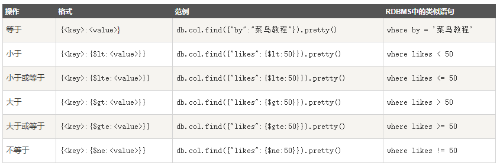

### 文档基本操作：查 ###
MongoDB 查询文档使用 find() 方法。

find() 方法以非结构化的方式来显示所有文档。

#### find()方法 ####
MongoDB 查询数据的语法格式如下：

	db.collection.find(query, projection)
	
参数说明：

	query ：可选，使用查询操作符指定查询条件
	projection ：可选，使用投影操作符指定返回的键。查询时返回文档中所有键值， 只需省略该参数即可（默认省略）。

如果你需要以易读的方式来读取数据，可以使用 pretty() 方法，语法格式如下：

	db.col.find().pretty()

pretty() 方法以格式化的方式来显示所有文档。

#### MongoDB 与 RDBMS Where 语句比较 ####

#### MongoDB AND 条件 ####
MongoDB 的 find() 方法可以传入多个键(key)，每个键(key)以逗号隔开，即常规 SQL 的 AND 条件。

语法格式如下：

	db.col.find({key1:value1, key2:value2}).pretty()

实例：

	db.col.find({"by":"菜鸟教程", "title":"MongoDB 教程"}).pretty()

#### MongoDB OR 条件 ####

MongoDB OR 条件语句使用了关键字 $or,语法格式如下：

	db.col.find(
	   {
	      $or: [
	         {key1: value1}, {key2:value2}
	      ]
	   }
	).pretty()

实例：

	db.col.find({$or:[{"by":"菜鸟教程"},{"title": "MongoDB 教程"}]}).pretty()

#### AND 和 OR 联合使用 ####

实例：

	db.col.find({"likes": {$gt:50}, $or: [{"by": "菜鸟教程"},{"title": "MongoDB 教程"}]}).pretty()